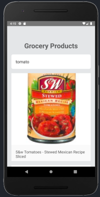
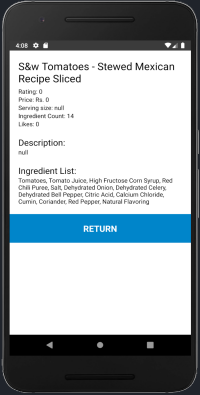

This project was bootstrapped with [EXPO](https://reactnative.dev/docs/environment-setup).

## Project Info

This project contains all the node modules so you just need to clone and run the project.
The api is taken from [NEWSAPI.ORG](https://newsapi.org/)

## Available Scripts

In the project directory, you can run:

### `yarn android` || `yarn start`

### Project Image

